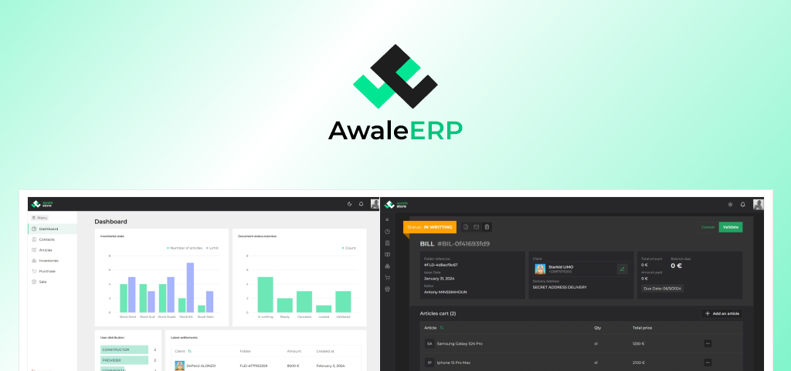

<br/>
<br/>
<div align="center">
  <a href="https://awale.vercel.app">
    
  </a>
  <h3 align="center">Awale Enterprise Resource Software</h3>
  <p align="center">
    A small and opinionated ERP software for small and medium size businesses.
    <br />
    <br />
    <a href="https://awale.vercel.app">Learn more about AwaleERP</a>
    ·
    <a href="https://awale.vercel.app/sign-in">Try AwaleERP</a>
  </p>
</div>
<br/>

## About AwaleERP

AwaleERP is a powerful and flexible Enterprise Resource Planning (ERP) software designed to streamline and optimize business operations.

<div align="center">

</div>
<br/>

It provides a comprehensive suite of tools to manage various aspects of a business, including collaboration, client management, inventory tracking, and sales/purchase processes. Built with scalability and customization in mind, AwaleERP is suitable for businesses of all sizes and industries.

## Features

- 🛠️ Collaborator Management: Administrators can create and manage collaborator accounts for seamless communication and coordination within the app.

- 📝 Client Management: Administrators and collaborators can add and manage client accounts, enabling a client-centric approach to business operations.

- 📦 Inventory Management: Collaborators can create products, specify details, and assign them to pre-added inventories for efficient inventory tracking.

- 📋 Sales and Purchase Documents: Collaborators can create and organize sale or purchase documents within customizable folders, streamlining the sales and purchase process.

## Getting started

Getting started
To get started with this project:

Backend API:

```bash
  git clone https://github.com/monlasan/awale-backend-api.git
```

and copy the .env.sample variables into a separate .env file, fill them out and following run the commands:

```bash
  yarn install
  yarn dev
```

Frontend API:

```bash
  git clone https://github.com/monlasan/awale-frontend-app.git
```

and copy the .env.sample variables into a separate .env file, fill them out and following run the commands:

```bash
  pnpm install
  pnpm dev
```

## Contributing

Contributions are welcome! Please follow the contribution guidelines when making changes to the project.

## License

This project is licensed under the MIT License.

## Contact

[@monlasan](https://twitter.com/monla_san)
